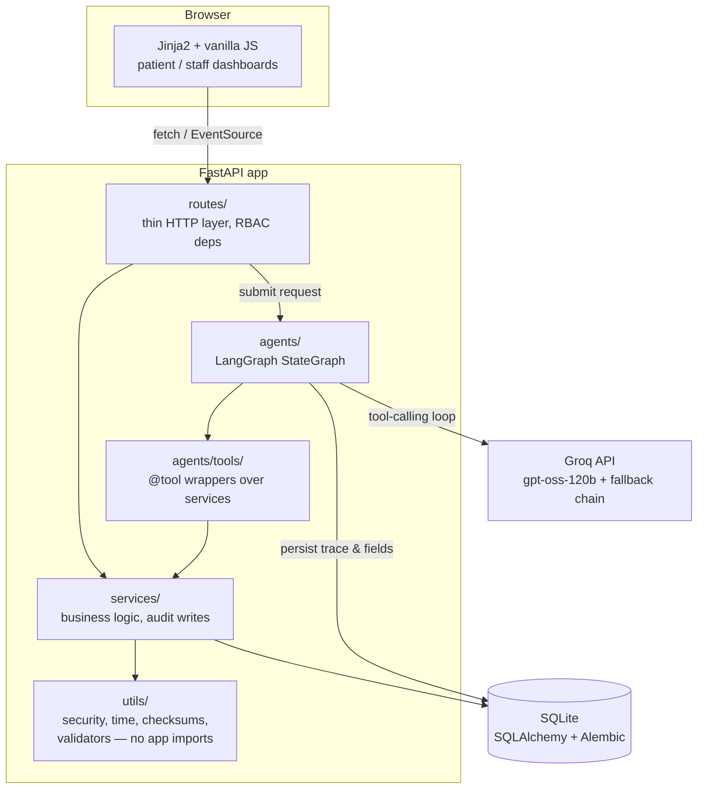
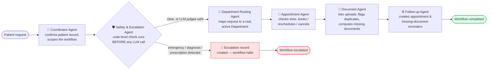
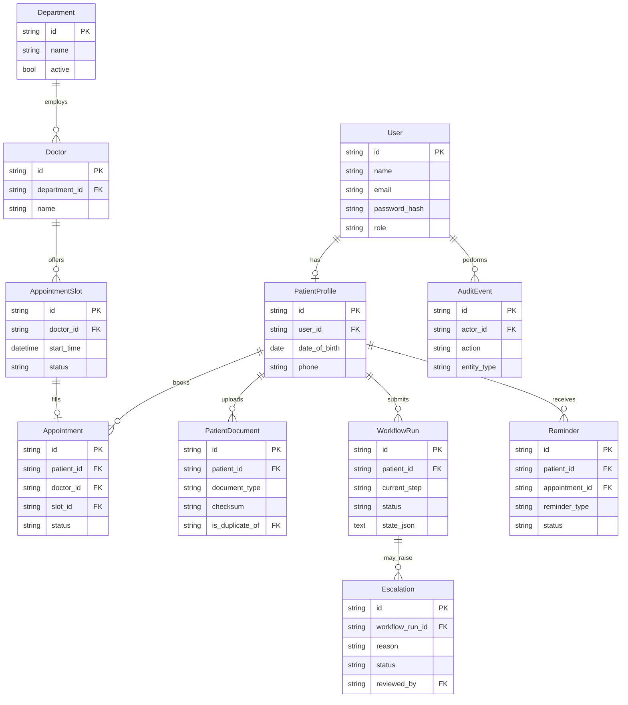

# AgentCare

**Agentic AI for patient administration and care coordination.**

AgentCare plans, routes, and executes a patient's *non-clinical* administrative journey — registration, department routing, appointment booking, document coordination, reminders, and follow-up — through six purpose-built LangGraph agents, with every action persisted, audited, and escalated to a human when it matters.

> [!IMPORTANT]
> AgentCare is an **administrative coordination system, not a clinical one**. It never diagnoses conditions, prescribes medication, recommends dosages, or otherwise substitutes for a healthcare professional. Emergency and clinical requests are always routed to human staff — see [Safety boundary](#safety-boundary).

## Contents

- [Features](#features)
- [Tech stack](#tech-stack)
- [Architecture](#architecture)
- [Agent pipeline](#agent-pipeline)
- [Data model](#data-model)
- [Getting started](#getting-started)
- [Running tests](#running-tests)
- [Project structure](#project-structure)
- [Design decisions](#design-decisions)
- [Roles, RBAC, audit & escalation](#roles-rbac-audit--escalation)
- [Safety boundary](#safety-boundary)

## Features

- **Six distinct agents**, each with its own prompt and tool set, orchestrated with LangGraph: Coordinator, Safety & Escalation, Department Routing, Appointment, Document, and Follow-up.
- **Live workflow streaming** — submit a request in plain language and watch each agent's stage arrive over Server-Sent Events, with a confirmation popup once it completes.
- **Deterministic safety boundary** — emergency and diagnosis/prescription requests are caught in code before the LLM is ever called, and always escalate to a human.
- **Real tools, real data** — every agent tool wraps a service that reads or writes persisted SQL state (patient records, slots, appointments, documents, reminders, escalations); nothing returns a canned response.
- **Role-based access control** enforced server-side (FastAPI dependencies reading a signed JWT), not just hidden UI buttons.
- **Full audit trail** — every mutating action is written to an `AuditEvent` row and visible to staff.
- **Document coordination** — upload classification, SHA-256 duplicate detection, and missing-document checks per department.

## Tech stack

| Concern | Choice |
|---|---|
| Language / runtime | Python 3.10+ |
| API framework | FastAPI + Uvicorn |
| Agent orchestration | [LangGraph](https://github.com/langchain-ai/langgraph) (`StateGraph`), LangChain-core for tool schemas |
| LLM | [Groq](https://groq.com/) — `openai/gpt-oss-120b` primary, with an automatic fallback chain (`openai/gpt-oss-20b` → `llama-3.3-70b-versatile` → `llama-3.1-8b-instant`) via `langchain-groq` |
| Database | SQLite (persistent, file-based) via SQLAlchemy 2.0 ORM + Alembic migrations |
| Workflow-state checkpointer | LangGraph `MemorySaver` (dev) or `SqliteSaver` (persistent) |
| Auth | JWT (`python-jose`) + `passlib`/`bcrypt`, delivered as an httponly cookie |
| Live updates | Server-Sent Events (`text/event-stream`) |
| Frontend | Jinja2 templates + vanilla HTML/CSS/JS — no SPA framework |
| Config | `pydantic-settings`, `.env` |
| Tests | `pytest`, FastAPI `TestClient`, in-memory SQLite |

## Architecture

The backend is layered strictly in one direction — routes call services, services call utils, and nothing calls upward. Agents sit alongside services (they *are* a service-layer concern) and are the only thing that talks to the LLM.



**Request lifecycle for a patient request:**

1. `POST /api/workflows` creates a `WorkflowRun` row and hands it to a FastAPI `BackgroundTask` (runs in a thread pool — the event loop stays free).
2. The frontend opens `GET /api/workflows/{id}/stream`, an SSE connection that watches the `WorkflowRun` row and pushes a `stage` event each time an agent finishes, then a `done` event with the structured result.
3. Each agent node persists its own trace entry and any new fields (department, appointment, missing documents, escalation reason) into `WorkflowRun.state_json` — so progress is queryable via plain SQL, independent of the LangGraph checkpointer.

## Agent pipeline



Each agent has its **own system prompt** (`src/backend/prompts/`) and **own tool subset** (`src/backend/agents/tools/`) — no shared prompt, no relabeled helper functions. The compiled graph runs with a checkpointer (`MemorySaver` for dev, `SqliteSaver` for a persistent checkpoint log) selected via `LANGGRAPH_CHECKPOINTER`.

| Agent | File | Tools |
|---|---|---|
| Coordinator | `agents/coordinator.py` | `get_patient_profile`, `log_agent_decision` |
| Safety & Escalation | `agents/safety_agent.py` | `create_escalation` (+ deterministic keyword rules in `utils/validators.py`) |
| Department Routing | `agents/routing_agent.py` | `list_departments`, `classify_department` |
| Appointment | `agents/appointment_agent.py` | `list_doctors`, `list_open_slots`, `book_appointment`, `reschedule_appointment`, `cancel_appointment` |
| Document | `agents/document_agent.py` | `list_patient_documents`, `missing_documents` |
| Follow-up | `agents/followup_agent.py` | `create_appointment_reminder`, `create_document_followup_reminder` |

## Data model



## Getting started

### Prerequisites

- Python 3.10+
- A [Groq API key](https://console.groq.com/keys) (free tier is enough to run this)
- [`uv`](https://docs.astral.sh/uv/) (recommended) or plain `pip`

### 1. Install dependencies

```powershell
uv sync --all-extras
```

<details>
<summary>Using plain pip instead</summary>

```powershell
python -m venv .venv
.venv\Scripts\activate
pip install -e ".[dev]"
```

</details>

> [!NOTE]
> `passlib` 1.7.4 (the last release) mis-detects modern `bcrypt` 4.x during its self-test. `pyproject.toml` already pins `bcrypt<4.0.0` — if you hit `ValueError: password cannot be longer than 72 bytes` from `passlib`, reinstall with that pin. Similarly, `pydantic[email]` (which pulls in `email-validator`) is required for the `EmailStr` fields — also already pinned.

### 2. Configure environment

```powershell
copy .env.example .env
```

Edit `.env` and set `GROQ_API_KEY`. Everything else has a sensible default for local development, including `GROQ_FALLBACK_MODELS` — a comma-separated backup list (`openai/gpt-oss-20b,llama-3.3-70b-versatile,llama-3.1-8b-instant` by default) used automatically if the primary model errors.

### 3. Create the database

```powershell
$env:PYTHONPATH = "src"
alembic upgrade head
```

### 4. Seed synthetic demo data

```powershell
python -m backend.seed.seed_data
```

This creates six departments, several doctors, two weeks of open appointment slots, and three demo accounts — **all synthetic, no real patient data**:

| Role | Email | Password |
|---|---|---|
| Patient | `patient@agentcare.demo` | `Patient123!` |
| Staff | `staff@agentcare.demo` | `Staff123!` |
| Admin | `admin@agentcare.demo` | `Admin123!` |

### 5. Run the app

```powershell
uvicorn backend.main:app --reload --app-dir src
```

Visit **http://127.0.0.1:8000/info** for the product overview, or go straight to `/login`.

## Running tests

```powershell
python -m pytest -q
```

Tests spin up an isolated in-memory SQLite database per test (`tests/conftest.py`) and override FastAPI's `get_db` dependency — nothing touches your local `data/agentcare.db`. The Safety Agent's deterministic escalation path is tested end-to-end without any network calls, by monkeypatching its module-level `SessionLocal` onto the test engine. No test suite calls the real Groq API.

## Project structure

```
src/
├── backend/
│   ├── main.py              # FastAPI app factory, router mounting
│   ├── config.py             # pydantic-settings
│   ├── db/                   # engine, session, Alembic migrations
│   ├── models/                # SQLAlchemy ORM models
│   ├── schemas/               # Pydantic request/response DTOs
│   ├── utils/                 # lowest layer: security, time, checksums, validators, retry
│   ├── services/               # business logic, audit writes — uses utils only
│   ├── prompts/                # one system prompt per agent
│   ├── agents/                 # LangGraph nodes, state, graph wiring
│   │   └── tools/               # @tool wrappers over services
│   ├── routes/                  # thin HTTP layer — calls services/agents only
│   └── seed/                    # synthetic demo data
└── frontend/
    ├── templates/                # Jinja2 (info, auth, patient, staff)
    └── static/{css,js}           # design tokens, shared components, per-page JS
```

## Design decisions

**Strict `routes → services → utils` layering.** `utils/` never imports from `services/` or `routes/`; `services/` never imports from `routes/`. This keeps business logic (and its unit tests) independent of HTTP concerns, and makes the dependency graph a straight line instead of a tangle — a code reviewer can tell at a glance that a bug in slot-booking logic can't be caused by a routing decorator.

**Deterministic safety checks run before the LLM, not instead of it.** `utils/validators.py` keyword-matches emergency and diagnosis/prescription language in plain Python, and the Safety Agent checks this *first* — only falling back to an LLM judgement call for ambiguous cases. This means the safety boundary required by the brief holds even if the LLM is down, rate-limited, or talked into ignoring its system prompt; it's a code-level circuit breaker, not a suggestion.

**SSE over client-side polling.** The background workflow already writes its progress to the `WorkflowRun` row after every agent step. Rather than have the browser poll `GET /api/workflows/{id}` on a timer, the stream endpoint does that polling server-side (every 400ms) and pushes only new trace entries over a single long-lived connection — fewer round trips, and the frontend renders each agent's stage as it lands instead of in one batch at the end.

**One retry policy, not two stacked ones.** The Groq SDK has its own built-in retry; `langchain-groq`'s client is configured with `max_retries=0` and every LLM call instead goes through `utils/retry.py`, which does exponential backoff with full jitter (`random(0, min(max_delay, base·2ⁿ))`). A single, observable retry policy is easier to reason about than two independent ones compounding their wait times.

**Model fallback chain, layered under the retry policy.** A single Groq model can be rate-limited, temporarily overloaded, or deprecated without notice — and a hackathon demo shouldn't go down because of it. `agents/llm.py::get_llm_with_fallbacks` binds each agent's tools to the primary model *and* every backup model (`GROQ_FALLBACK_MODELS`), then chains them with LangChain's native `.with_fallbacks()`. On error, the next model in the chain is tried immediately — no backoff delay — since a different model is very unlikely to be failing for the same reason. The jittered-backoff retry still wraps the *whole* chain: if every model fails (e.g. a network blip), the entire chain is retried with backoff before the step is reported as failed. This gives two independent, complementary layers of resilience instead of one doing both jobs badly.

**Tools are thin wrappers over services, never inline logic.** Every `@tool` function in `agents/tools/` opens a session, calls a `services/` function, and returns a plain dict. This is what makes the tools "real" per the brief's requirement — an agent tool can't silently drift from what the REST API and the rest of the app does, because they call the exact same service function.

## Roles, RBAC, audit & escalation

- **Patients** can create/update their profile, submit requests, book/reschedule/cancel appointments, upload documents, and view their reminders — all scoped to their own `PatientProfile` via `require_patient` in `routes/deps.py`.
- **Staff/admin** can view all workflow runs, approve or reject escalations, manage departments/doctors/slots, and read the full audit log — via `require_staff`.
- Role checks happen **server-side, on every route**, reading the role claim out of a signed JWT cookie. Hiding a button in the UI is never the enforcement mechanism.
- Every mutating service call writes an `AuditEvent` (`services/audit_service.py::record`) — bookings, cancellations, escalation decisions, document uploads, doctor/slot creation. Staff can browse the full trail in the console's Audit log tab.
- Escalations created by the Safety Agent sit in an `open` state until a staff/admin member approves or rejects them through `POST /api/staff/escalations/{id}/decision` — itself an audited action.

## Safety boundary

AgentCare coordinates the **non-clinical** parts of a patient's journey only. It does not, and is designed not to:

- diagnose a condition or interpret symptoms clinically,
- prescribe or change a medication,
- recommend a dosage,
- claim to replace a clinician's judgement.

Emergency language (chest pain, difficulty breathing, unconsciousness, suicidal ideation, and similar) and clinical-overreach requests (asking for a diagnosis, a prescription, or a dosage) are caught by a deterministic, unit-tested check in `utils/validators.py` *before* the request ever reaches the LLM, and are always routed to a human via an `Escalation` record. This is a property of the code, not a hope about how the model will behave.

> [!WARNING]
> This project uses only synthetic, generated demo data (see [Getting started](#getting-started)). It is not connected to any real hospital system and must not be used to store or process real patient information.
